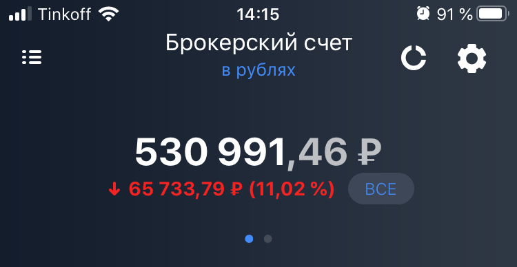
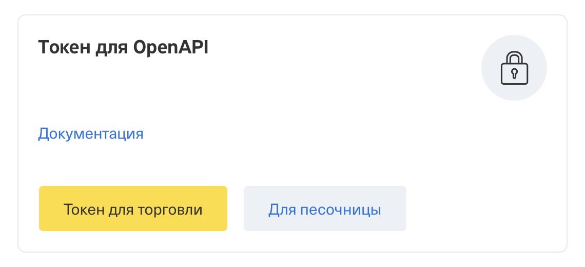
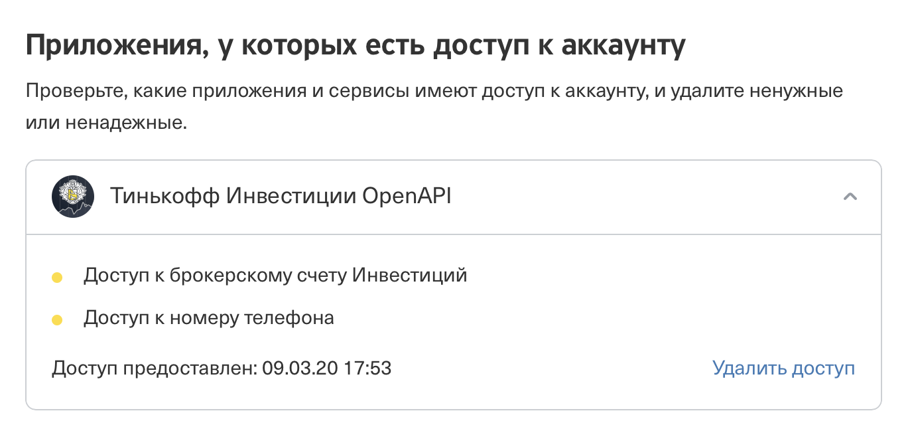

## Что это

Это приложение командной строки, которое использует [Open API Тинькофф Инвестиций][openapi]
для получения информации о вашем портфеле, чтобы вести точный учет.
Оно не предназначено и не совершает никаких сделок,
использует только методы API для чтения.


## Зачем это

Инвестируя какое-то время с помощью сервиса [Тинькофф Инвестиции][referral]
(реферальная ссылка) я задался вопросом, а насколько мои инвестиции эффективны.

На первый взгляд кажется, что узнать это довольно просто,
ведь в шапке приложения показывается стоимость моего текущего портфеля
и изменение его стоимости.



Но у этого отображения есть огромное количество недостатков:

* Самое главное — не учитываются уже проданные бумаги
* Не учитывается разница в курсе на момент покупки бумаги
* Не учитываются купоны и дивиденды
* Не учитывается комиссия брокера и налоги

Поэтому я решил создать удобный инструмент для получения истории всех
операций в портфеле, что позволило вести учет всего вышеперечисленного
и наглядно видеть успехи инвестирования.


## Безопасность

При разработке приложения безопасность была поставлена во главу угла.
Open API Тинькофф Инвестиций на мой взгляд имеет ряд недостатков,
связанных с безопасностью:

* Токен передается в явном виде в заголовке запроса ([issue][open-token-issue])
* Нет разграничения прав токена, любой токен может быть использован
  для операций с вашим портфелем ([issue][restrict-token-issue])

Поэтому я считаю особенно важно не допускать компрометации токена.

По этой причине **ваш токен хранится только в зашифрованном виде**,
а для каждого запуска приложения нужно заново вводить пароль,
которым зашифрован токен. Это может показаться утомительным,
однако это позволяет полностью исключить доступ к вашим бумагам,
даже если злоумышленник получит полный доступ к вашему комьютеру.

Для шифровки токена используется [алгорит шифрования Salsa20][salsa20-resistance],
на текущий момент не имеющий доказанный уязвимостей,
а к паролю предъявляются строгие треботвания по входящим символам и длине.


## Установка

Приложение написано на языке [Python][python-wiki],
для его работы понадобится [интерпретатор не ниже версии 3.7][python-download].

```sh
$ git checkout https://github.com/homm/invest.git
$ cd invest
$ python3 -m venv env && source ./env/bin/activate
$ pip install -r requirements.txt
```


## Токен и первый запуск

При первом запуске приложение попросит вас придумать пароль,
которым будет зашифрован токен.

```sh
$ ./run.py set_token
Seems like this is the first run. Please fill the credentials to continue.
At first, you need to choose a password.

Password should be at least 12 ASCII chars length.
It can't consist of digits only. At least one char in UPPER and lower case is required.
New password: 🔒
```

После ввода пароля приложение попросит вставить из буфера обмена токен.

```
Now please paste the token once.
Do not store it anywhere else.

Paste token: 🔒
```

Токен — это ключ, необходимый для авторизации вас как пользователя Open API
Тинькофф Инвестиций. Это длинная последовательность почти случайных символов,
что исключает угадывание этого ключа другими пользователями.

Получить токен можно в [настройках аккаунта Тинькофф Инвестиций][invest-settings].
На данный момент этот блок выглядит так:



Для сохранности токена рекомендуется закрыть страницу с настройками аккаунта
сразу после того, как вы скопируете токен в буфер обмена.
А после того как вы вставите токен из буфера обмена в приложение и нажмете энтер,
рекомендуется скопировать в буфер обмена любой другой текст,
чтобы потом случайно не вставить токен куда-то ещё.

После окончания работы приложение выведет что-то вроде этого:

```
Put this code to the `conf.py` file:
# ------------- conf.py ------------
enc_token_nonce = b'\r}@\xae<$m\xee'
enc_token = (
    b"\x13\xb7\x06\x0e\xc6\x01V\x13\xa4\xeby\x1a?.T\xa9E'J\xa6S\xdf\xfbI\xc2U["
    b'P\xc3\xe3\x85\xaf\xb7v\x99<\\\xf5\xa34\xe4OH\xe6ZP"\xf0'
)
```

Это и есть зашифрованный токен. Создайте файл `conf.py` в этой же директории
и вставьте в него эти строки. Как альтернатива, приложение можно было запустить так:

```sh
$ ./run.py set_token >> conf.py
```

Тогда файл `conf.py` создастся автоматически, ничего копировать не нужно будет.

Отозвать ранее выпущенный токен можно на [странице безопасности аккаунта][tinkoff-security] банка.
На данный момент этот блок выглядит так:




## Доступные команды

### Задать новый токен

```sh
$ ./run.py set_token -h
usage: run.py set_token [-h]
```

Эта команда рассмотрена выше. Она запускается в самом начале, если токен не задан.

### Сменить пароль

```sh
$ ./run.py change_password -h
usage: run.py change_password
```

Запрашивает старый пароль, которым уже зашифрован текущий токен,
а затем новый пароль. Выводит в конце такие же строки, как `set_token`,
так как смена пароля по сути является сменой зашифрованного токена.

### Вывести портфель

```sh
$ ./run.py portfolio -h
usage: run.py portfolio [-h]
```

Выводит содержимое портфеля в виде таблицы с символами табуляции
в качестве разделителя столбцов. Пример:
```
$ ./run.py portfolio 
Password: 

Ticker	Name	Quantity	Price	Currency
IVZ	Invesco	36	7.92	USD
NLMK	НЛМК	90	124.84	RUB
TSM	Taiwan Semiconductor Manufacturing	4	46.90	USD
FNKO	Funko Inc	15	3.30	USD
PLCE	Children's Place Inc The	7	15.30	USD
XLNX	Xilinx	5	78.73	USD
T	AT&T	7	27.51	USD
PHOR	ФосАгро	8	2429.62	RUB
TCS	TCS Group (Tinkoff Bank holder)	21	11.20	USD
GLW	Corning	10	17.95	USD
CSCO	Cisco	3	39.10	USD
RU000A101GW3	ЛЕГЕНДА выпуск 2	20	938.24	RUB
RU000A101HU5	Брусника выпуск 1	10	937.13	RUB
FXTB	Казначейские облигации США (USD)	10	787.30	RUB
FXIT	Акции компаний IT-сектора США	10	5787.10	RUB
FXRL	Акции российских компаний	11	2606.77	RUB
USD	Доллар США	84	76.49	RUB
```

### Вывести историю операций

```sh
$ ./run.py log -h
usage: run.py log [-h] --from DATE_FROM [--to DATE_TO] [--group]

optional arguments:
  --from DATE_FROM
  --to DATE_TO
  --group
```

Выводит историю операций в виде таблицы с символами табуляции
в качестве разделителя столбцов. Обратите внимание,
что аргумент `--from` является оязательным.

```
$ ./run.py log --from 2020-03-01
Password: 

Ticker	Name	Date	Quantity	Sum	Currency	Sum (USD)
$TAX	TaxBack	2020-03-02		400.00	RUB	5.98
RU000A101GW3	BrokerCommission	2020-03-03		-3.00	RUB	-0.04
RU000A101GW3	ЛЕГЕНДА выпуск 2	2020-03-03	6	-6000.00	RUB	-89.69
ATVI	BrokerCommission	2020-03-04		-0.12	USD	-0.12
ATVI	Activision Blizzard	2020-03-04	-4	248.24	USD	248.24
$TAX	Tax	2020-03-04		-252.00	RUB	-3.80
T	BrokerCommission	2020-03-09		-0.05	USD	-0.05
T	AT&T	2020-03-09	3	-103.50	USD	-103.50
RU000A101HU5	BrokerCommission	2020-03-12		-4.84	RUB	-0.07
RU000A101HU5	Брусника выпуск 1	2020-03-12	10	-9680.00	RUB	-134.44
FXTB	BrokerCommission	2020-03-13		-3.68	RUB	-0.05
FXTB	Казначейские облигации США (USD)	2020-03-13	10	-7350.00	RUB	-102.08
$COM	ServiceCommission	2020-03-16		-3.96	USD	-3.96
NLMK	BrokerCommission	2020-03-16		-2.17	RUB	-0.03
NLMK	НЛМК	2020-03-16	40	-4340.80	RUB	-57.88
USD	BrokerCommission	2020-04-01		-0.43	USD	-0.43
USD	Доллар США	2020-04-01	-850	67145.75	RUB	850.00
```

Позже я еще вернусь к этой таблице.


[openapi]: https://tinkoffcreditsystems.github.io/invest-openapi/
[referral]: https://www.tinkoff.ru/sl/4NJDEmwpqsn
[open-token-issue]: https://github.com/TinkoffCreditSystems/invest-openapi/issues/161
[restrict-token-issue]: https://github.com/TinkoffCreditSystems/invest-openapi/issues/12
[salsa20-resistance]: https://en.wikipedia.org/wiki/Salsa20#Cryptanalysis_of_Salsa20
[python-wiki]: https://ru.wikipedia.org/wiki/Python
[python-download]: https://www.python.org/downloads/
[invest-settings]: https://www.tinkoff.ru/invest/settings/
[tinkoff-security]: https://id.tinkoff.ru/account/security
